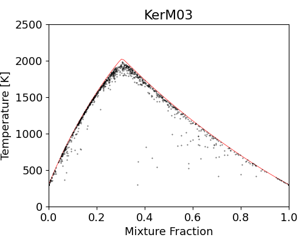

## PaSR

Partially Stirred Reactor using Cantera for validating mixing models.

#### 1. Dependencies

```
cantera >= 2.5
mlpack
networkx
```


#### 2. Part of results

+ PaSR simulation results of H2/N2-Air mixture, with IEM, MC and EMST as mixing model.

    

+ PaSR simulation results of H2/N2-Air mixture, with KerM as mixing model of different kernel sizes.

    


#### 3. Implementation details

##### 3.1 EMST variance decay

The mixing happens on the edges of EMST tree, with:


The parameter $\alpha$ controls the variance decay rate. Denoting , then from time  to , one has:


And by variance decay rule of micro-mixing model:
$$
Var(t+\delta t)-Var(t) = \left[e^{-\Omega_\phi\delta t}-1\right]Var(t)  \approx -\Omega_\phi \delta t Var(t)
$$
Thus, following the variance decay rule, we need to let  satisfy the equation
$$
\begin{align*}
\alpha^2\delta t\langle d\phi^2\rangle + 2\alpha \langle \phi \cdot d\phi \rangle + \Omega_\phi \langle\phi''^2\rangle = 0
\end{align*}
$$
In general, $A\equiv\delta t\langle d\phi^2\rangle>0$, $B\equiv 2 \langle \phi \cdot d\phi \rangle <0$, $C\equiv\Omega_\phi \langle\phi''^2\rangle>0$. To get at least one real number solution, one need:
$$
B^2-4AC\ge0 \Rightarrow \delta t\le \frac{\langle\phi\cdot d\phi\rangle}{\Omega_\phi\langle d\phi^2\rangle\langle\phi''^2\rangle}
$$
Once $\delta t$ is selected, the mixing ratio $\alpha$ is hence to be:
$$
\alpha=\frac{-B+\sqrt{B^2-4AC}}{2A}
$$


#### 4. References

+ PaSR: https://github.com/SLACKHA/pyJac/blob/master/pyjac/functional_tester/partially_stirred_reactor.py
+ EMST: https://tcg.mae.cornell.edu/emst/
