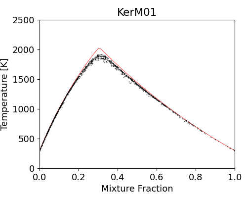

## PaSR

Partially Stirred Reactor using Cantera for validating mixing models.

#### 1. Dependencies

```
cantera >= 2.5
mlpack, networkx
yaml, numpy, scipy, matplotlib
```


#### 2. Usage

```yaml
### Typical input file (this example is in "inputs/KerM01.yaml")
# Input parameters for PaSR simulation.
case: non-premixed
mech: "mech/h2_sandiego.yaml"
mixing model: "KerM"
sigma_k: 0.1
number of particles: 1000
temperature: 300.0
pressure: 1.0
equivalence ratio: 1.0
residence time: 2.e-3
mixing time: 0.7e-3
number of residence times: 5
fuel:
  H2: 1.0
  N2: 1.0
oxidizer:
  O2: 0.21
  N2: 0.79
```

```shell
### Run PaSR simulation
# specify input by `--input`, output by `--output`
python PaSR_main.py --input inputs/KerM01.yaml --output data/KerM01.npy --doplot
# which can be written in short as
python PaSR_main.py -i inputs/KerM01.yaml -p
```

+ PaSR simulation results of H2/N2-Air mixture, with IEM, MC and EMST as mixing model.

    

+ PaSR simulation results of H2/N2-Air mixture, with KerM as mixing model of different kernel sizes.

    


#### 3. Implementation details

##### 3.1 EMST variance decay

The mixing happens on the edges of EMST tree, with:

<p style="text-align:center"></p>

The parameter  controls the variance decay rate. Denoting, then from time  to , one has:

<p style="text-align:center"></p>

And by variance decay rule of micro-mixing model:

<p style="text-align:center"></p>

Thus, following the variance decay rule, we need to let  satisfy the equation

<p style="text-align:center"></p>

In general, 0" title="\inline A\equiv\delta t\langle d\phi^2\rangle>0" />,, 0" title="\inline C\equiv\Omega_\phi \langle\phi''^2\rangle>0" />. To get at least one real number solution, one need:

<p style="text-align:center"></p>

Once  is selected, the mixing ratio  is hence to be:

<p style="text-align:center"></p>

For multiple scalars, single  could not lead to target variance decay for all scalars. So a root finding technique is employed to estimate best . 

<p style="text-align:center"></p>

Typically, the root finding process converges in 2-3 loops.


#### 4. References

+ Mixing Model paper

  Z. Ren, S.B. Pope, An investigation of the performance of turbulent mixing models, *Combust. Flame* 136 (2004) 208-216.

+ EMST paper

  S. Subramaniam, S.B. Pope, A mixing model for turbulent reactive flows based on Euclidean minimum spanning trees, *Combust. Flame* 115 (1998) 487-514.

+ EMST code

  https://tcg.mae.cornell.edu/emst/

+ PaSR code

  https://github.com/SLACKHA/pyJac/blob/master/pyjac/functional_tester/partially_stirred_reactor.py
